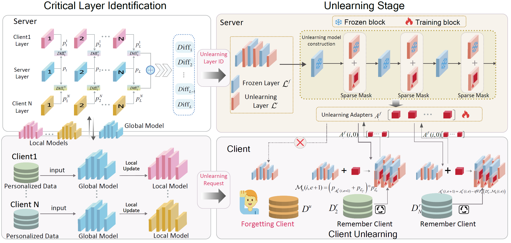

# Unlearning through Knowledge Overwriting: Reversible Federated Unlearning via Selective Sparse Adapter
Welcome to the repository! This is the detailed implementation of our project, FUSED. We hope this code will serve as a valuable resource for understanding our work and its application. Thank you for your interest and support!

## Dependencies
```
torch==2.2.1+cu121
numpy==1.24.3
scikit-learn==1.3.2
objgraph==3.6.1
pandas==2.0.2
torchvision==0.17.0+cu121
joblib==1.3.2
transformers==4.37.2
```
## Datasets
### Image Datasets
-[Cifar10](https://www.cs.toronto.edu/~kriz/cifar.html)  
-[Cifar100](https://www.cs.toronto.edu/~kriz/cifar.html)  
-[FashionMNIST](https://www.worldlink.com.cn/en/osdir/fashion-mnist.html)

## Quick start
```angular2html
python main.py --data_name='fashionmnist' --forget_paradigm='client' --paradigm='fused'  --global_epoch=100 --local_epoch=5 --alpha=1.0
```

